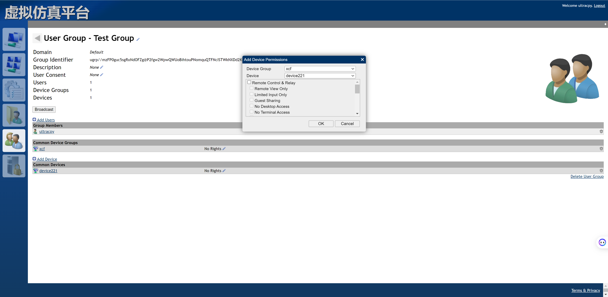
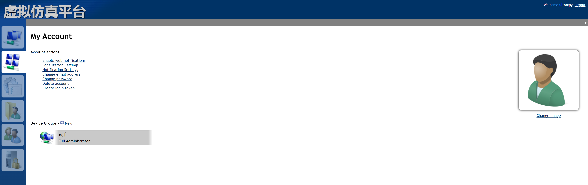

# 有关Id

## 前缀所代表的含义

### user

user//ultracpy

### device

node//@wihFdI@OP2lV8TjxHZDe5Rj8oOlDycPdTyIZyE2c2IT9KBMk8c7zN@YndJM26eY

### device group

mesh//CDyO@xMDvKEgTObv1Pm@Ml21RZSTUTVoOjOhxHYpzPW1khsm@DS3mPbezVKJLVva

### user group

ugrp//mzFP0guc5sgRxNdOFZg@P2fgw2WpwQWUoBihtouPNomquQTFNcISTWkNXDd2KmX4

## 传参时是否需要带前缀

### 前缀是指以下四个之一

user//

node//

mesh//

ugrp//

### 是否需要前缀的标准儿

非常难以辨别 o(╥﹏╥)o！

The user identifier.（可能不需要带user//前缀）

--userid 可能不需要带user//前缀

# Actions

## Help

```shell
node .\meshctrl.js --url wss://192.168.1.160 --loginuser ultracpy --loginpass XCFxcf123456 help ListDeviceGroups

```

node meshctrl.js help serverinfo

Get information on the MeshCentral server, Example usages:

  MeshCtrl ServerInfo --loginuser myaccountname --loginpass mypassword

  MeshCtrl ServerInfo --loginuser myaccountname --loginkeyfile key.txt

Optional arguments:

  --json                 - Show result as JSON.

## ServerInfo

    - Show server information.

## ListUserSessions

    - List online users.


### help

```shell
node .\meshctrl.js help ListUserSessions --url wss://192.168.1.160 --loginuser ultracpy --loginpass XCFxcf123456
```

output：

```
List active user sessions on the MeshCentral server, Example usages:

  MeshCtrl ListUserSessions
  MeshCtrl ListUserSessions --json

```

### example:

```shell
node .\meshctrl.js ListUserSessions --json --url wss://192.168.1.160 --loginuser ultracpy --loginpass XCFxcf123456
```

output:

```json
{
  "user//ultracpy": 3
}

```

## ListUsersOfDeviceGroup

    - List the users in a device group.


### help

```shell
node .\meshctrl.js --url wss://192.168.1.160 --loginuser ultracpy --loginpass XCFxcf123456 Help ListUsersOfDeviceGroup
```

output

```
List users that have permissions for a given device group. Example usage:

  MeshCtrl ListUserOfDeviceGroup

Required arguments:

  --id [groupid]         - Device group identifier.

Optional arguments:

  --json                 - Show result as JSON.

```

### example

注意：

完整的device group id是这样的 `mesh//CDyO@xMDvKEgTObv1Pm@Ml21RZSTUTVoOjOhxHYpzPW1khsm@DS3mPbezVKJLVva`

但是此处参数id需要去掉mesh//前缀，只使用 `CDyO@xMDvKEgTObv1Pm@Ml21RZSTUTVoOjOhxHYpzPW1khsm@DS3mPbezVKJLVva`

` node .\meshctrl.js --url wss://192.168.1.160 --loginuser ultracpy --loginpass XCFxcf123456 ListUsersOfDeviceGroup --id CDyO@xMDvKEgTObv1Pm@Ml21RZSTUTVoOjOhxHYpzPW1khsm@DS3mPbezVKJLVva`

error output

```
Group id not found
```

correct output

```
{
  "user//ultracpy": {
    "name": "ultracpy",
    "rights": 4294967295
  },
  "ugrp//uohOIfxclBdzzCm2JoqaadmsuAirDfA4tWd$HRye9dijER9ZkxPpYuYLFc3QYG1d": {
    "name": "用户组1",
    "rights": 4294967295
  }
}

```

### check group id exist

```shell
node .\meshctrl.js --url wss://192.168.1.160 --loginuser ultracpy --loginpass XCFxcf123456 ListDeviceGroups --idexists mesh//CDyO@xMDvKEgTObv1Pm@Ml21RZSTUTVoOjOhxHYpzPW1khsm@DS3mPbezVKJLVva
```

## ListEvents

    - List server events.


### help

```shell
 node .\meshctrl.js --url wss://192.168.1.160 --loginuser ultracpy --loginpass XCFxcf123456 help ListEvents
```

output

```
List server events optionally filtered by user or device. Example usage:

  MeshCtrl ListEvents

Optional arguments:

  --userid [name]        - User account identifier.
  --id [deviceid]        - The device identifier.
  --limit [number]       - Maximum number of events to list.
  --raw                  - Output raw data in JSON format.
  --json                 - Give results in JSON format.

```

### example

```shell
node .\meshctrl.js --url wss://192.168.1.160 --loginuser ultracpy --loginpass XCFxcf123456 ListEvents --json
```

output

```json
[
  {
    "etype": "mesh",
    "username": "用户组1",
    "userid": "user//ultracpy",
    "meshid": "mesh//CDyO@xMDvKEgTObv1Pm@Ml21RZSTUTVoOjOhxHYpzPW1khsm@DS3mPbezVKJLVva",
    "name": "xcf",
    "mtype": 2,
    "desc": "",
    "action": "meshchange",
    "links": {
      "user//ultracpy": {
        "name": "ultracpy",
        "rights": 4294967295
      },
      "ugrp//uohOIfxclBdzzCm2JoqaadmsuAirDfA4tWd%24HRye9dijER9ZkxPpYuYLFc3QYG1d": {
        "name": "用户组1",
        "rights": 4294967295
      }
    },
    "msg": "Added user 用户组1 to device group xcf",
    "time": "2023-08-29T03:12:24.067Z"
  },
  {
    "etype": "ugrp",
    "username": "ultracpy",
    "ugrpid": "ugrp//uohOIfxclBdzzCm2JoqaadmsuAirDfA4tWd$HRye9dijER9ZkxPpYuYLFc3QYG1d",
    "name": "用户组1",
    "desc": "描述",
    "action": "usergroupchange",
    "links": {
      "node//@wihFdI@OP2lV8TjxHZDe5Rj8oOlDycPdTyIZyE2c2IT9KBMk8c7zN@YndJM26eY": {
        "rights": 8
      },
      "mesh//CDyO@xMDvKEgTObv1Pm@Ml21RZSTUTVoOjOhxHYpzPW1khsm@DS3mPbezVKJLVva": {
        "rights": 4294967295
      }
    },
    "msgid": 79,
    "msgArgs": [
      "用户组1"
    ],
    "msg": "User group changed: 用户组1",
    "time": "2023-08-29T03:12:24.066Z"
  }
]
```

## LoginTokens

    - List, create and remove login tokens.


### help

```shell
node .\meshctrl.js --url wss://192.168.1.160 --loginuser ultracpy --loginpass XCFxcf123456 help LoginTokens 
```

## Device

### ListDevices

    - List devices.


#### help

```shell
node meshctrl.js --url wss://192.168.1.160 --loginuser ultracpy --loginpass XCFxcf123456 help ListDevices
```

output

```
List devices. Example usages:

  MeshCtrl ListDevices
  MeshCtrl ListDevices -id [groupid] --json

Optional arguments:

  --id [groupid]         - Filter by group identifier (or --group).
  --group [groupname]    - Filter by group name (or --id).
  --count                - Only return the device count.
  --json                 - Show result as JSON.
  --csv                  - Show result as comma separated values.
  --filter "[filter]"  - Filter devices using a filter string.
     "x"                  - Devices with "x" in the name.
     "user:x or u:x"      - Devices with "x" in the name of currently logged in user.
     "ip:x"               - Devices "x" IP address.
     "group:x or g:x"     - Devices with "x" in device group name.
     "tag:x or t:x"       - Devices with "x" in device tag.
     "atag:x or a:x"      - Devices with "x" in device agent tag.
     "os:x"               - Devices with "x" in the device OS description.
     "amt:x"              - Devices with Intel AMT provisioning state (0, 1, 2).
     "desc:x"             - Devices with "x" in device description.
     "wsc:ok"             - Devices with Windows Security Center ok.
     "wsc:noav"           - Devices with Windows Security Center with anti-virus problem.
     "wsc:noupdate"       - Devices with Windows Security Center with update problem.
     "wsc:nofirewall"     - Devices with Windows Security Center with firewall problem.
     "wsc:any"            - Devices with Windows Security Center with any problem.
     "a and b"            - Match both conditions with precedence over OR. For example: "lab and g:home".
     "a or b"             - Math one of the conditions, for example: "lab or g:home".
  --filterid [id,id...]  - Show only results for devices with included id.
  --details              - Show all device details.

```

#### example all

```shell
node .\meshctrl.js --url wss://192.168.1.160 --loginuser ultracpy --loginpass XCFxcf123456 ListDevices --json
```

or use hex

```shell
 node .\meshctrl.js --url wss://192.168.1.160 --loginuser ultracpy --loginpass XCFxcf123456 listdevicegroups --hex
```

output

```json
[
  {
    "type": "node",
    "mtype": 2,
    "_id": "node//FZP6OMUWQb5UY74EsQPun8VGD1$x1b5IM3OlDYq4Oh5SMmJSqYsyF6vsZYq262CT",
    "icon": 1,
    "name": "WIN-PL0NK596VLK",
    "rname": "WIN-PL0NK596VLK",
    "domain": "",
    "agent": {
      "ver": 0,
      "id": 4,
      "caps": 31,
      "core": "Dec 9 2022, 4145944574",
      "root": true
    },
    "host": "192.168.1.187",
    "osdesc": "Microsoft Windows Server 2008 R2 Enterprise  - 7601",
    "ip": "192.168.1.187",
    "av": [],
    "users": [],
    "conn": 1,
    "pwr": 1,
    "agct": 1693276086509,
    "meshid": "mesh//CDyO@xMDvKEgTObv1Pm@Ml21RZSTUTVoOjOhxHYpzPW1khsm@DS3mPbezVKJLVva",
    "groupname": "xcf"
  },
  {
    "type": "node",
    "mtype": 2,
    "_id": "node//@wihFdI@OP2lV8TjxHZDe5Rj8oOlDycPdTyIZyE2c2IT9KBMk8c7zN@YndJM26eY",
    "icon": 1,
    "name": "CPY_XCF_WIN10",
    "rname": "CPY_XCF_WIN10",
    "domain": "",
    "agent": {
      "ver": 0,
      "id": 4,
      "caps": 31,
      "core": "Dec 9 2022, 4145944574",
      "root": true
    },
    "host": "192.168.1.55",
    "ip": "192.168.1.55",
    "osdesc": "Microsoft Windows 11 企业版 - 21H2/22000",
    "av": [],
    "wsc": {
      "antiVirus": "OK",
      "autoUpdate": "OK",
      "firewall": "OK"
    },
    "users": [
      "CPY_XCF_WIN10\\CPY"
    ],
    "conn": 1,
    "pwr": 1,
    "agct": 1693276087164,
    "meshid": "mesh//CDyO@xMDvKEgTObv1Pm@Ml21RZSTUTVoOjOhxHYpzPW1khsm@DS3mPbezVKJLVva",
    "groupname": "xcf"
  }
]

```

#### example spercific group

```shell
node .\meshctrl.js --url wss://192.168.1.160 --loginuser ultracpy --loginpass XCFxcf123456 ListDevices --json --groupname xcf
```

or use group_id(alias meshid)

```shell
 node .\meshctrl.js --url wss://192.168.1.160 --loginuser ultracpy --loginpass XCFxcf123456 ListDevices --json --id mesh//CDyO@xMDvKEgTObv1Pm@Ml21RZSTUTVoOjOhxHYpzPW1khsm@DS3mPbezVKJLVv
```

#### example filter

filter name with XCF

```shell
 node .\meshctrl.js --url wss://192.168.1.160 --loginuser ultracpy --loginpass XCFxcf123456 ListDevices --json --groupname xcf --filter "XCF"
```

### DeviceInfo

    - Show information about a device.


#### help

```shell
node .\meshctrl.js --url wss://192.168.1.160 --loginuser ultracpy --loginpass XCFxcf123456 help DeviceInfo
```

output

```
Display information about a device, Example usages:

  MeshCtrl DeviceInfo --id deviceid
  MeshCtrl DeviceInfo --id deviceid --json

Required arguments:

  --id [deviceid]        - The device identifier.

Optional arguments:

  --raw                  - Output raw data in JSON format.
  --json                 - Give results in JSON format.

```

#### example

```shell
 node .\meshctrl.js --url wss://192.168.1.160 --loginuser ultracpy --loginpass XCFxcf123456 DeviceInfo --id node//FZP6OMUWQb5UY74EsQPun8VGD1$x1b5IM3OlDYq4Oh5SMmJSqYsyF6vsZYq262CT --json
```

output

```json
{
  "General": {
    "Server Name": "WIN-PL0NK596VLK",
    "Computer Name": "WIN-PL0NK596VLK",
    "Hostname": "192.168.1.187",
    "IP Address": "192.168.1.187",
    "Icon": 1,
    "AntiVirus": []
  },
  "Operating System": {
    "Name": "WIN-PL0NK596VLK",
    "Version": "Microsoft Windows Server 2008 R2 Enterprise  - 7601"
  },
  "Mesh Agent": {
    "Mesh Agent": "Windows 64bit service",
    "Last agent connection": "Connected now"
  }
}

```

### EditDevice

    - Make changes to a device.


注意：

只有被安排到此设备下的人员才有权限修改设备信息（上图是有权限的截图，下图是无权限的截图）。


#### help

```shell
node .\meshctrl.js --url wss://192.168.1.160 --loginuser ultracpy --loginpass XCFxcf123456 help editdevice
```

output

```
Change information about a device, Example usages:

  MeshCtrl EditDevice --id deviceid --name device1

Required arguments:

  --id [deviceid]        - The device identifier.

Optional arguments:

  --name [name]          - Change device name.
  --desc [description]   - Change device description.
  --tags [tag1,tags2]    - Change device tags.
  --icon [number]        - Change the device icon (1 to 8).
  --consent [flags]      - Sum of the following numbers:
      1 = Desktop notify          2 = Terminal notify
      4 = Files notify            8 = Desktop prompt
     16 = Terminal prompt        32 = Files prompt
     64 = Desktop privacy bar

```

#### example

```shell
 node .\meshctrl.js --url wss://192.168.1.160 --loginuser ultracpy --loginpass XCFxcf123456 EditDevice --id node//@wihFdI@OP2lV8TjxHZDe5Rj8oOlDycPdTyIZyE2c2IT9KBMk8c7zN@YndJM26eY --name device2
```

error output

```
Access Denied
```

correct output

`ok`

### RemoveDevice

    - Delete a device.

#### help

```shell
node .\meshctrl.js --url wss://192.168.1.160 --loginuser ultracpy --loginpass XCFxcf123456 help RemoveDevice
```

output

```
Delete a device, Example usages:

  MeshCtrl RemoveDevice --id deviceid

Required arguments:

  --id [deviceid]        - The device identifier.

```

## Config

    - Perform operation on config.json file.

help

```shell
 node .\meshctrl.js --url wss://192.168.1.160 --loginuser ultracpy --loginpass XCFxcf123456 help Config
```

output

```
Perform operations on the config.json file. Example usage:

  MeshCtrl config --show

Optional arguments:

  --show                        - Display the config.json file.
  --listdomains                 - Display non-default domains.
  --adddomain [domain]          - Add a domain.
  --removedomain [domain]       - Remove a domain.
  --settodomain [domain]        - Set values to the domain.
  --removefromdomain [domain]   - Remove values from the domain.

With adddomain, removedomain, settodomain and removefromdomain you can add the key and value pair. For example:

  --adddomain "MyDomain" --title "My Server Name" --newAccounts false
  --settodomain "MyDomain" --title "My Server Name"
  --removefromdomain "MyDomain" --title

```

example

```shell
node .\meshctrl.js --url wss://192.168.1.160 --loginuser ultracpy --loginpass XCFxcf123456  config --show
```

error output

```
Unable to find config.json.

```

## User

### ListUsers

    - List user accounts.


#### help

```shell
node .\meshctrl.js --url wss://192.168.1.160 --loginuser ultracpy --loginpass XCFxcf123456 help listusers
```

output

```
List the account on the MeshCentral server, Example usages:

  MeshCtrl ListUsers
  MeshCtrl ListUsers --json
  MeshCtrl ListUsers --nameexists "bob"
  MeshCtrl ListUsers --filter 2fa

Optional arguments:

  --idexists [id]        - Return 1 if id exists, 0 if not.
  --nameexists [name]    - Return id if name exists.
  --filter [filter1,...] - Filter user names: 2FA, NO2FA.
  --json                 - Show result as JSON.

```

#### example

```shell
node .\meshctrl.js --url wss://192.168.1.160 --loginuser ultracpy --loginpass XCFxcf123456 listusers --json
```

correct output

```shell
[
  {
    "_id": "user//ultracpy",
    "name": "ultracpy",
    "email": "ultracpy@gmail.com",
    "creation": 1693275399,
    "login": 1693285470,
    "access": 1693289680,
    "siteadmin": 4294967295,
    "links": {
      "mesh//CDyO@xMDvKEgTObv1Pm@Ml21RZSTUTVoOjOhxHYpzPW1khsm@DS3mPbezVKJLVva": {
        "rights": 4294967295
      },
      "ugrp//mzFP0guc5sgRxNdOFZg@P2fgw2WpwQWUoBihtouPNomquQTFNcISTWkNXDd2KmX4": {
        "rights": 1
      }
    },
    "pastlogin": 1693276724
  }
]

```

### UserInfo

    - Show user information.

help

```shell
node .\meshctrl.js --url wss://192.168.1.160 --loginuser ultracpy --loginpass XCFxcf123456 Help UserInfo
```

output

```
Get account information for the login account, Example usages:

  MeshCtrl UserInfo --loginuser myaccountname --loginpass mypassword
  MeshCtrl UserInfo --loginuser myaccountname --loginkeyfile key.txt

Optional arguments:

  --json                 - Show result as JSON.

```

example

```shell
node .\meshctrl.js --url wss://192.168.1.160 --loginuser ultracpy --loginpass XCFxcf123456 UserInfo --json
```

output

```json
{
  "_id": "user//ultracpy",
  "name": "ultracpy",
  "email": "ultracpy@gmail.com",
  "creation": 1693275399,
  "login": 1693285470,
  "access": 1693290286,
  "siteadmin": 4294967295,
  "links": {
    "mesh//CDyO@xMDvKEgTObv1Pm@Ml21RZSTUTVoOjOhxHYpzPW1khsm@DS3mPbezVKJLVva": {
      "rights": 4294967295
    },
    "ugrp//mzFP0guc5sgRxNdOFZg@P2fgw2WpwQWUoBihtouPNomquQTFNcISTWkNXDd2KmX4": {
      "rights": 1
    }
  },
  "pastlogin": 1693276724
}

```

### AddUser

    - Create a new user account.


#### help

```shell
node .\meshctrl.js --url wss://192.168.1.160 --loginuser ultracpy --loginpass XCFxcf123456 help AddUser
```

output

```
Add a new user account. Example usages:

  MeshCtrl AddUser --user newaccountname --pass newpassword
  MeshCtrl AddUser --user newaccountname --randompass --rights full

Required arguments:

  --user [name]               - New account name.
  --pass [password]           - New account password.
  --randompass                - Create account with a random password.

Optional arguments:

  --domain [domain]           - Account domain, only for cross-domain admins.
  --email [email]             - New account email address.
  --emailverified             - New account email is verified.
  --resetpass                 - Request password reset on next login.
  --realname [name]           - Set the real name for this account.
  --phone [number]            - Set the account phone number.
  --rights [none|full|a,b,c]  - Comma separated list of server permissions. Possible values:
     manageusers,backup,restore,update,fileaccess,locked,nonewgroups,notools,usergroups,recordings,locksettings,allevents

```

#### example

```shell
node .\meshctrl.js --url wss://192.168.1.160 --loginuser ultracpy --loginpass XCFxcf123456 AddUser --user nuosar --pass XCFxcf123456 --rights full
```

correct output

`ok`

### EditUser

    - Change a user account.


#### help

```shell
node .\meshctrl.js --url wss://192.168.1.160 --loginuser ultracpy --loginpass XCFxcf123456 help EditUser
```

output

```
Edit a user account, Example usages:

  MeshCtrl EditUser --userid user --rights locked,locksettings
  MeshCtrl EditUser --userid user --realname Jones

Required arguments:

  --userid [name]             - User account identifier.

Optional arguments:

  --domain [domain]           - Account domain, only for cross-domain admins.
  --email [email]             - Account email address.
  --emailverified             - Account email is verified.
  --resetpass                 - Request password reset on next login.
  --realname [name]           - Set the real name for this account.
  --phone [number]            - Set the account phone number.
  --rights [none|full|a,b,c]  - Comma separated list of server permissions. Possible values:
     manageusers,backup,restore,update,fileaccess,locked,nonewgroups,notools,usergroups,recordings,locksettings,allevents
```

#### example

correct output

### RemoveUser

    - Delete a user account.

#### help

```shell
node .\meshctrl.js --url wss://192.168.1.160 --loginuser ultracpy --loginpass XCFxcf123456 help RemoveUser
```

output

```
Delete a user account, Example usages:

  MeshCtrl RemoveUser --userid accountid

Required arguments:

  --userid [id]          - Account identifier.


```

#### example

```shell
node .\meshctrl.js --url wss://192.168.1.160 --loginuser ultracpy --loginpass XCFxcf123456 RemoveUser --userid user//nuosar
```

correct output

`ok`

## UserGroup

### ListUserGroups

    - List user groups.


#### help

```shell
node .\meshctrl.js help ListUserGroups --url wss://192.168.1.160 --loginuser ultracpy --loginpass XCFxcf123456
```

output

```
List user groups on the MeshCentral server, Example usages:

  MeshCtrl ListUserGroups
  MeshCtrl ListUserGroups --json

```

#### example

```shell
node .\meshctrl.js ListUserGroups --json --url wss://192.168.1.160 --loginuser ultracpy --loginpass XCFxcf123456
```

output:

```json
{
  "ugrp//uohOIfxclBdzzCm2JoqaadmsuAirDfA4tWd$HRye9dijER9ZkxPpYuYLFc3QYG1d": {
    "type": "ugrp",
    "_id": "ugrp//uohOIfxclBdzzCm2JoqaadmsuAirDfA4tWd$HRye9dijER9ZkxPpYuYLFc3QYG1d",
    "name": "用户组1",
    "desc": "描述",
    "domain": "",
    "links": {}
  }
}

```

### AddUserGroup

    - Create a new user group.


#### help

```shell
node .\meshctrl.js --url wss://192.168.1.160 --loginuser ultracpy --loginpass XCFxcf123456 help AddUserGroup
```

output

```
Create a new user group, Example usages:

  MeshCtrl AddUserGroup --name "Test Group"

Required arguments:

  --name [name]          - Name of the user group.

```

#### example

```shell
node .\meshctrl.js --url wss://192.168.1.160 --loginuser ultracpy --loginpass XCFxcf123456 AddUserGroup --name "Test Group"
```

correct output

`ok`

### RemoveUserGroup

    - Delete a user group.

#### help

```shell
node .\meshctrl.js --url wss://192.168.1.160 --loginuser ultracpy --loginpass XCFxcf123456 help RemoveUserGroup
```

output

```
Remove a user group, Example usages:

  MeshCtrl RemoveUserGroup --groupid ugrp//abcdf

Required arguments:

  --groupid [groupid]   - User group identifier.

```

#### example

```shell
node .\meshctrl.js --url wss://192.168.1.160 --loginuser ultracpy --loginpass XCFxcf123456 RemoveUserGroup --groupid ugrp//n@js0UaXwtw9e4IUUviYbjuR3Vi9aqf7v5XY7tgCLAFBPMIKaWDcp7kHTfMePsJB 
```

correct output

`ok`

error output

`Invalid domain id` or `Unknown device group`

### AddToUserGroup

    - Add a user, device or device group to a user group.


#### help

```shell
node .\meshctrl.js --url wss://192.168.1.160 --loginuser ultracpy --loginpass XCFxcf123456 help AddToUserGroup
```

output

```
Add a user, device or device group to a user group, Example usages:

  MeshCtrl AddToUserGroup --id user//abcdef --groupid ugrp//abcdf
  MeshCtrl AddToUserGroup --id node//abcdef --groupid ugrp//abcdf --rights [rights]
  MeshCtrl AddToUserGroup --id mesh//abcdef --groupid ugrp//abcdf --rights [rights]

Required arguments:

  --id [id]             - Identifier to add.
  --groupid [groupid]   - User group identifier.

Optional arguments:

  --rights [number]     - Rights granted for adding device or device group.
                        - 4294967295 for full admin or the sum of the following numbers.
          1 = Edit Device Group                2 = Manage Users
          4 = Manage Computers                 8 = Remote Control
         16 = Agent Console                   32 = Server Files
         64 = Wake Device                    128 = Set Notes
        256 = Remote View Only               512 = No Terminal
       1024 = No Files                      2048 = No Intel AMT
       4096 = Desktop Limited Input         8192 = Limit Events
      16384 = Chat / Notify                32768 = Uninstall Agent
      65536 = No Remote Desktop           131072 = Remote Commands
     262144 = Reset / Power off

```

#### example

##### add user to user_group


```shell
node .\meshctrl.js --url wss://192.168.1.160 --loginuser ultracpy --loginpass XCFxcf123456 AddToUserGroup --id user//ultracpy --groupid ugrp//mzFP0guc5sgRxNdOFZg@P2fgw2WpwQWUoBihtouPNomquQTFNcISTWkNXDd2KmX4
```

##### add device to user_group



```shell
 node .\meshctrl.js --url wss://192.168.1.160 --loginuser ultracpy --loginpass XCFxcf123456 AddToUserGroup --id node//@wihFdI@OP2lV8TjxHZDe5Rj8oOlDycPdTyIZyE2c2IT9KBMk8c7zN@YndJM26eY --groupid ugrp//mzFP0guc5sgRxNdOFZg@P2fgw2WpwQWUoBihtouPNomquQTFNcISTWkNXDd2KmX4
```

##### add device_group to user_group

```shell
node .\meshctrl.js --url wss://192.168.1.160 --loginuser ultracpy --loginpass XCFxcf123456 AddToUserGroup --id mesh//CDyO@xMDvKEgTObv1Pm@Ml21RZSTUTVoOjOhxHYpzPW1khsm@DS3mPbezVKJLVva --groupid ugrp//mzFP0guc5sgRxNdOFZg@P2fgw2WpwQWUoBihtouPNomquQTFNcISTWkNXDd2KmX4
```

correct output

`ok`

### RemoveFromUserGroup

    - Remove a user, device or device group from a user group.

#### help

```shell
node .\meshctrl.js --url wss://192.168.1.160 --loginuser ultracpy --loginpass XCFxcf123456 help RemoveFromUserGroup
```

output

```
Remove a user, device or device group from a user group, Example usages:

  MeshCtrl RemoveUserFromUserGroup --userid user//abcdef --groupid ugrp//abcdf
  MeshCtrl RemoveUserFromUserGroup --userid node//abcdef --groupid ugrp//abcdf
  MeshCtrl RemoveUserFromUserGroup --userid mesh//abcdef --groupid ugrp//abcdf

Required arguments:

  --id [userid]         - Identifier to remove.
  --groupid [groupid]   - User group identifier.

```

### RemoveAllUsersFromUserGroup

    - Remove all users from a user group.

#### help

```shell
node .\meshctrl.js --url wss://192.168.1.160 --loginuser ultracpy --loginpass XCFxcf123456 help RemoveAllUsersFromUserGroup
```

output

```
Remove all users from a user group, Example usages:

  MeshCtrl RemoveAllUsersFromUserGroup --groupid ugrp//abcdf

Required arguments:

  --groupid [groupid]   - User group identifier.
```

## DeviceGroup

### ListDeviceGroups

    - List device groups.



#### help

```shell
node .\meshctrl.js --url wss://192.168.1.160 --loginuser ultracpy --loginpass XCFxcf123456 help ListDeviceGroups
```

output

```
List the device groups for this account. Example usages:

  MeshCtrl ListDeviceGroups
  MeshCtrl ListDeviceGroups --json

Optional arguments:

  --idexists [id]        - Return 1 if id exists, 0 if not.
  --nameexists [name]    - Return id if name exists.
  --emailexists [email]  - Return id if email exists.
  --hex                  - Display meshid in hex format.
  --json                 - Show result as JSON.
```

#### example

```shell
node .\meshctrl.js --url wss://192.168.1.160 --loginuser ultracpy --loginpass XCFxcf123456 ListDeviceGroups --json
```

output

```
[
  {
    "type": "mesh",
    "_id": "mesh//CDyO@xMDvKEgTObv1Pm@Ml21RZSTUTVoOjOhxHYpzPW1khsm@DS3mPbezVKJLVva",
    "name": "xcf",
    "mtype": 2,
    "desc": "",
    "domain": "",
    "links": {
      "user//ultracpy": {
        "name": "ultracpy",
        "rights": 4294967295
      }
    },
    "creation": 1693275405904,
    "creatorid": "user//ultracpy",
    "creatorname": "ultracpy"
  }
]

```

### AddDeviceGroup

    - Create a new device group.


#### help

```shell
node .\meshctrl.js --url wss://192.168.1.160 --loginuser ultracpy --loginpass XCFxcf123456 help AddDeviceGroup 
```

output

```
Add a device group, Example usages:

  MeshCtrl AddDeviceGroup --name newgroupname
  MeshCtrl AddDeviceGroup --name newgroupname --desc description --amtonly
  MeshCtrl AddDeviceGroup --name newgroupname --features 1 --consent 7

Required arguments:

  --name [name]          - Name of the new group.

Optional arguments:

  --desc [description]   - New group description.
  --amtonly              - New group is agent-less, Intel AMT only.
  --agentless            - New group is agent-less only.
  --features [number]    - Set device group features, sum of numbers below.
     1 = Auto-Remove                 2 = Hostname Sync
     4 = Record Sessions
  --consent [number]     - Set device group user consent, sum of numbers below.
     1 = Desktop notify user         2 = Terminal notify user
     4 = Files notify user           8 = Desktop prompt user
    16 = Terminal prompt user       32 = Files prompt user
    64 = Desktop Toolbar

```

example

correct output

### RemoveDeviceGroup

    - Delete a device group.

#### help

```shell
node .\meshctrl.js --url wss://192.168.1.160 --loginuser ultracpy --loginpass XCFxcf123456 help RemoveDeviceGroup
```

output

```
Remove a device group, Example usages:

  MeshCtrl RemoveDeviceGroup --id groupid

Required arguments:

  --id [groupid]         - Device group identifier (or --group).
  --group [groupname]    - Device group name (or --id).

```

### EditDeviceGroup

    - Change a device group values.

#### help

```shell
node .\meshctrl.js --url wss://192.168.1.160 --loginuser ultracpy --loginpass XCFxcf123456 help EditDeviceGroup
```

output

```
Edit a device group, Example usages:

  MeshCtrl EditDeviceGroup --id groupid --name "New Name"
  MeshCtrl EditDeviceGroup --id groupid --desc "Description" --consent 63
  MeshCtrl EditDeviceGroup --id groupid --invitecodes "code1,code2" --backgroundonly

Required arguments:

  --id [groupid]         - Device group identifier (or --group).
  --group [groupname]    - Device group name (or --id).

Optional arguments:

  --name [name]          - Set new device group name.
  --desc [description]   - Set new device group description, blank to clear.
  --flags [number]       - Set device group flags, sum of the values below, 0 for none.
     1 = Auto remove device on disconnect.
     2 = Sync hostname.
  --consent [number]     - Set device group consent options, sum of the values below, 0 for none.
     1 = Desktop notify user.
     2 = Terminal notify user.
     4 = Files notify user.
     8 = Desktop prompt for user consent.
    16 = Terminal prompt for user consent.
    32 = Files prompt for user consent.
    64 = Desktop show connection toolbar.
  --invitecodes [aa,bb]  - Comma separated list of invite codes, blank to clear.
    --backgroundonly     - When used with invitecodes, set agent to only install in background.
    --interactiveonly    - When used with invitecodes, set agent to only run on demand.

```

### MoveToDeviceGroup

    - Move a device to a different device group.

#### help

```shell
 node .\meshctrl.js --url wss://192.168.1.160 --loginuser ultracpy --loginpass XCFxcf123456 help MoveToDeviceGroup
```

output

```
Move a device to a new device group, Example usages:

  MeshCtrl MoveToDeviceGroup --devid deviceid --id groupid

Required arguments:

  --id [groupid]         - Device group identifier (or --group).
  --group [groupname]    - Device group name (or --id).
  --devid [deviceid]     - Device identifier.

```

#### example

```shell
node .\meshctrl.js --url wss://192.168.1.160 --loginuser ultracpy --loginpass XCFxcf123456 MoveToDeviceGroup --devid node//@wihFdI@OP2lV8TjxHZDe5Rj8oOlDycPdTyIZyE2c2IT9KBMk8c7zN@YndJM26eY --group xcf
```

error output

`Device not found` - 原因是这个设备没有分配给此账号

correct output

`ok`

### AddUserToDeviceGroup

    - Add a user to a device group.


#### help

```shell
node .\meshctrl.js --url wss://192.168.1.160 --loginuser ultracpy --loginpass XCFxcf123456 help AddUserToDeviceGroup
```

output

```
Add a user to a device group, Example usages:

  MeshCtrl AddUserToDeviceGroup --id groupid --userid userid --fullrights
  MeshCtrl AddUserToDeviceGroup --group groupname --userid userid --editgroup --manageusers

Required arguments:

  --id [groupid]         - Device group identifier (or --group).
  --group [groupname]    - Device group name (or --id).
  --userid [userid]      - The user identifier.

Optional arguments:

  --fullrights           - Allow full rights over this device group.
  --editgroup            - Allow the user to edit group information.
  --manageusers          - Allow the user to add/remove users.
  --managedevices        - Allow the user to edit device information.
  --remotecontrol        - Allow device remote control operations.
  --agentconsole         - Allow agent console operations.
  --serverfiles          - Allow access to group server files.
  --wakedevices          - Allow device wake operation.
  --notes                - Allow editing of device notes.
  --desktopviewonly      - Restrict user to view-only remote desktop.
  --limiteddesktop       - Limit remote desktop keys.
  --noterminal           - Hide the terminal tab from this user.
  --nofiles              - Hide the files tab from this user.
  --noamt                - Hide the Intel AMT tab from this user.
  --limitedevents        - User can only see his own events.
  --chatnotify           - Allow chat and notification options.
  --uninstall            - Allow remote uninstall of the agent.

```

#### example

注意：参数

```shell
node .\meshctrl.js --url wss://192.168.1.160 --loginuser ultracpy --loginpass XCFxcf123456 AddUserToDeviceGroup --group nuosar --userid wts --fullrights
```

correct output

`Added user wts`

error output

`Nothing done`

### RemoveUserFromDeviceGroup

    - Remove a user from a device group.


#### help

```shell
node .\meshctrl.js --url wss://192.168.1.160 --loginuser ultracpy --loginpass XCFxcf123456 help RemoveUserFromDeviceGroup
```

output

```
Remove a user from a device group, Example usages:

  MeshCtrl RemoveuserFromDeviceGroup --id groupid --userid userid

Required arguments:

  --id [groupid]         - Device group identifier (or --group).
  --group [groupname]    - Device group name (or --id).
  --userid [userid]      - The user identifier.

```

## UserAndDevice

### AddUserToDevice

    - Add a user to a device.


#### help

```shell
node .\meshctrl.js --url wss://192.168.1.160 --loginuser ultracpy --loginpass XCFxcf123456 help AddUserToDevice
```

output

```
Add a user to a device, Example usages:

  MeshCtrl AddUserToDevice --id deviceid --userid userid --fullrights
  MeshCtrl AddUserToDevice --id deviceid --userid userid --remotecontrol

Required arguments:

  --id [deviceid]        - The device identifier.
  --userid [userid]      - The user identifier.

Optional arguments:

  --fullrights           - Allow full rights over this device.
  --remotecontrol        - Allow device remote control operations.
  --agentconsole         - Allow agent console operations.
  --serverfiles          - Allow access to group server files.
  --wakedevices          - Allow device wake operation.
  --notes                - Allow editing of device notes.
  --desktopviewonly      - Restrict user to view-only remote desktop.
  --limiteddesktop       - Limit remote desktop keys.
  --noterminal           - Hide the terminal tab from this user.
  --nofiles              - Hide the files tab from this user.
  --noamt                - Hide the Intel AMT tab from this user.
  --limitedevents        - User can only see his own events.
  --chatnotify           - Allow chat and notification options.
  --uninstall            - Allow remote uninstall of the agent.

```

#### example

```shell
node .\meshctrl.js --url wss://192.168.1.160 --loginuser ultracpy --loginpass XCFxcf123456 AddUserToDevice --id node//@wihFdI@OP2lV8TjxHZDe5Rj8oOlDycPdTyIZyE2c2IT9KBMk8c7zN@YndJM26eY --userid ultracpy --fullrights
```

correct output

error output

卡死不动了

### RemoveUserFromDevice

    - Remove a user from a device.

#### help

```shell
node .\meshctrl.js --url wss://192.168.1.160 --loginuser ultracpy --loginpass XCFxcf123456 help RemoveUserFromDevice
```

output

```
Remove a user from a device, Example usages:

  MeshCtrl RemoveuserFromDeviceGroup --id deviceid --userid userid

Required arguments:

  --id [deviceid]        - The device identifier.
  --userid [userid]      - The user identifier.

```

#### example

```shell
node .\meshctrl.js --url wss://192.168.1.160 --loginuser ultracpy --loginpass XCFxcf123456 RemoveUserFromDevice --id node//@wihFdI@OP2lV8TjxHZDe5Rj8oOlDycPdTyIZyE2c2IT9KBMk8c7zN@YndJM26eY --userid ultracpy
```

correct output

`ok`

### SendInviteEmail

    - Send an agent install invitation email.

### GenerateInviteLink

    - Create an invitation link.


#### help

```shell
 node .\meshctrl.js --url wss://192.168.1.160 --loginuser ultracpy --loginpass XCFxcf123456 help GenerateInviteLink
```

output

```
Generate a agent invitation URL for a given group. Example usage:

  MeshCtrl GenerateInviteLink --id groupid --hours 24
  MeshCtrl GenerateInviteLink --group "My Computers" --hours 0

Required arguments:

  --id [groupid]         - Device group identifier (or --group).
  --group [groupname]    - Device group name (or --id).
  --hours [hours]        - Validity period in hours or 0 for infinite.

Optional arguments:

  --flags [mode]         - Mode flag for link type (0 = both, 1 = interactive only, 2 = background only)

```

#### example

correct output

### Broadcast

    - Display a message to all online users.


#### help

```shell
 node .\meshctrl.js --url wss://192.168.1.160 --loginuser ultracpy --loginpass XCFxcf123456 help Broadcast
```

output

```
Display a message to one or all logged in users, Example usages:

  MeshCtrl Broadcast --msg "This is a test"

Required arguments:

  --msg [message]        - Message to display.

Optional arguments:

  --user [userid]        - Send the message to the specified user.

```

#### example

```shell
node .\meshctrl.js --url wss://192.168.1.160 --loginuser ultracpy --loginpass XCFxcf123456  Broadcast --msg "MSG"
```

correct output

`ok`

### ShowEvents real-time

    - Display real-time server events in JSON format.

help

```shell
node .\meshctrl.js --url wss://192.168.1.160 --loginuser ultracpy --loginpass XCFxcf123456 help showevents
```

output

```
Show the server's event stream for this user account. Example usage:

  MeshCtrl ShowEvents
  MeshCtrl ShowEvents --filter nodeconnect
  MeshCtrl ShowEvents --filter uicustomevent,changenode

Optional arguments:

  --filter [actions]    - Show only specified actions.

```

example

correct output

```

```

### RunCommand

    - Run a shell command on a remote device.


help

```shell
 node .\meshctrl.js --url wss://192.168.1.160 --loginuser ultracpy --loginpass XCFxcf123456 help RunCommand
```

output

```
Run a shell command on a remote device, Example usages:

  MeshCtrl RunCommand --id deviceid --run "command"
  MeshCtrl RunCommand --id deviceid --run "command" --powershell

Required arguments:

  --id [deviceid]        - The device identifier.
  --run "[command]"    - Shell command to execute on the remote device.

Optional arguments:

  --powershell           - Run in Windows PowerShell.
  --runasuser            - Attempt to run the command as logged in user.
  --runasuseronly        - Only run the command as the logged in user.

```

example

correct output

### Shell（terminal）

    - Access command shell of a remote device.

访问远程terminal

help

```shell
 node .\meshctrl.js --url wss://192.168.1.160 --loginuser ultracpy --loginpass XCFxcf123456 help Shell
```

output

```
Access a command shell on a remote device, Example usages:

  MeshCtrl Shell --id deviceid
  MeshCtrl Shell --id deviceid --powershell

Required arguments:

  --id [deviceid]        - The device identifier.

Optional arguments:

  --powershell           - Run a Windows PowerShell.

```

### Upload

    - Upload a file to a remote device.

#### help

```shell
node .\meshctrl.js --url wss://192.168.1.160 --loginuser ultracpy --loginpass XCFxcf123456 help Upload
```

output

```
Upload a local file to a remote device, Example usages:

  MeshCtrl Upload --id deviceid --file sample.txt --target c:\
  MeshCtrl Upload --id deviceid --file sample.txt --target /tmp

Required arguments:

  --id [deviceid]        - The device identifier.
  --file [localfile]     - The local file to upload.
  --target [remotepath]  - The remote path to upload the file to.

```

#### example

```shell
node .\meshctrl.js --url wss://192.168.1.160 --loginuser ultracpy --loginpass XCFxcf123456 upload --id @wihFdI@OP2lV8TjxHZDe5Rj8oOlDycPdTyIZyE2c2IT9KBMk8c7zN@YndJM26eY --file readme.md --target c:\
```

correct output

```
Connecting...
Waiting for Agent...
Connected.
Uploading...
Upload done, 4617 bytes sent.
```

### Download

    - Download a file from a remote device.

#### help

```shell
node .\meshctrl.js --url wss://192.168.1.160 --loginuser ultracpy --loginpass XCFxcf123456 help Download 
```

output

```
Download a file from a remote device, Example usages:

  MeshCtrl Download --id deviceid --file C:\sample.txt --target c:\temp
  MeshCtrl Download --id deviceid --file /tmp/sample.txt --target /tmp

Required arguments:

  --id [deviceid]        - The device identifier.
  --file [remotefile]    - The remote file to download.

Optional arguments:

  --target [localpath]   - The local path to download the file to.

```

#### example

```shell
node .\meshctrl.js --url wss://192.168.1.160 --loginuser ultracpy --loginpass XCFxcf123456 download --id @wihFdI@OP2lV8TjxHZDe5Rj8oOlDycPdTyIZyE2c2IT9KBMk8c7zN@YndJM26eY --file c:\readme.md --target c:\test1\123.md
```

correct output

```
Connecting...
Waiting for Agent...
Connected.
Download started: c:\test1\123.md
Download completed, 4617 bytes written.
```

error output

```
Connecting...
Waiting for Agent...
Connected.
Unable to create file: c:\readme

```

### DeviceOpenUrl

    - Open a URL on a remote device.

#### help

```shell
node .\meshctrl.js --url wss://192.168.1.160 --loginuser ultracpy --loginpass XCFxcf123456 help DeviceOpenUrl   
```

output

```
Open a web page on a remote device, Example usages:

  MeshCtrl DeviceOpenUrl --id deviceid --openurl http://meshcentral.com

Required arguments:

  --id [deviceid]        - The device identifier.
  --openurl [url]        - Link to the web page.

```

#### example

correct output

```

```

error output

```

```

### DeviceMessage

    - Open a message box on a remote device.


#### help

```shell
node .\meshctrl.js --url wss://192.168.1.160 --loginuser ultracpy --loginpass XCFxcf123456 help DeviceMessage
```

output

```
Display a message on the remote device, Example usages:

  MeshCtrl DeviceMessage --id deviceid --msg "message"
  MeshCtrl DeviceMessage --id deviceid --msg "message" --title "title"

Required arguments:

  --id [deviceid]        - The device identifier.
  --msg [message]        - The message to display.

Optional arguments:

  --title [title]        - Messagebox title, default is "MeshCentral".

```

#### example

```shell
 node .\meshctrl.js --url wss://192.168.1.160 --loginuser ultracpy --loginpass XCFxcf123456 DeviceMessage --id @wihFdI@OP2lV8TjxHZDe5Rj8oOlDycPdTyIZyE2c2IT9KBMk8c7zN@YndJM26eY --msg "my content" --title "MyTitle"
```

correct output

```
ok
```


error output

```

```

### DeviceToast

    - Display a toast notification on a remote device.

#### help

```shell
node .\meshctrl.js --url wss://192.168.1.160 --loginuser ultracpy --loginpass XCFxcf123456 help DeviceToast
```

output

```
Display a toast message on the remote device, Example usages:

  MeshCtrl DeviceToast --id deviceid --msg "message"
  MeshCtrl DeviceToast --id deviceid --msg "message" --title "title"

Required arguments:

  --id [deviceid]        - The device identifier.
  --msg [message]        - The message to display.

Optional arguments:

  --title [title]        - Toast title, default is "MeshCentral".

```

#### example

```shell
node .\meshctrl.js --url wss://192.168.1.160 --loginuser ultracpy --loginpass XCFxcf123456 DeviceToast --id @wihFdI@OP2lV8TjxHZDe5Rj8oOlDycPdTyIZyE2c2IT9KBMk8c7zN@YndJM26eY --msg "my content" --title "MyTitle"
```

correct output

```
ok
```


error output

```

```

### DevicePower

    - Perform wake/sleep/reset/off operations on remote devices.


#### help

```shell
node .\meshctrl.js --url wss://192.168.1.160 --loginuser ultracpy --loginpass XCFxcf123456 help DevicePower 
```

output

```
Perform power operations on remote devices, Example usages:

  MeshCtrl DevicePower --wake --id deviceid
  MeshCtrl DevicePower --sleep --id deviceid
  MeshCtrl DevicePower --reset --id deviceid
  MeshCtrl DevicePower --off --id deviceid1,deviceid2

Note that some power operations may take up to a minute to execute.

Required arguments:

  --id [deviceid1,deviceid2]    - Device identifiers.

Optional arguments:

  --wake                        - Attempt to wake up the remote device.
  --reset                       - Attempt to remote the remote device.
  --sleep                       - Attempt to place the remote device in low power mode.
  --off                         - Attempt to power off the remote device.
  --amtoff                      - Attempt to power off the remote device using Intel AMT.
  --amton                       - Attempt to power on the remote device using Intel AMT.
  --amtreset                    - Attempt to reset the remote device using Intel AMT.

```

#### example

```shell
 node .\meshctrl.js --url wss://192.168.1.160 --loginuser ultracpy --loginpass XCFxcf123456 DevicePower --reset --id [deviceid1,deviceid2]
```

correct output

```

```

error output

```

```

### DeviceSharing

    - View, add and remove sharing links for a given device.


#### help

```shell
node .\meshctrl.js --url wss://192.168.1.160 --loginuser ultracpy --loginpass XCFxcf123456 help DeviceSharing
```

output

```
List sharing links for a specified device, Example usages:

  MeshCtrl DeviceSharing --id deviceid
  MeshCtrl DeviceSharing --id deviceid --remove abcdef
  MeshCtrl DeviceSharing --id deviceid --add Guest --start 2023-08-29T17:17:01 --duration 30
  MeshCtrl DeviceSharing --id deviceid --add Guest --start 2023-08-29T17:17:01 --duration 30 --daily
  MeshCtrl DeviceSharing --id deviceid --add Guest --type desktop,terminal --consent prompt

Required arguments:

  --id [deviceid]                - The device identifier.

Optional arguments:

  --remove [shareid]              - Remove a device sharing link.
  --add [guestname]               - Add a device sharing link.
  --type [desktop,terminal,files] - Type of sharing to add, can be combined. default is desktop.
  --viewonly                      - Make desktop sharing view only.
  --consent [notify,prompt]       - Consent flags, default is notify.
  --start [yyyy-mm-ddThh:mm:ss]   - Start time, default is now.
  --end [yyyy-mm-ddThh:mm:ss]     - End time.
  --duration [minutes]            - Duration of the share, default is 60 minutes.
  --daily                         - Add recurring daily device share.
  --weekly                        - Add recurring weekly device share.

```

#### example

correct output

```

```

error output

```

```

### AgentDownload

    - Download an agent of a specific type for a device group.

#### help

```shell
node .\meshctrl.js --url wss://192.168.1.160 --loginuser ultracpy --loginpass XCFxcf123456 help AgentDownload
```

output

```
Download an agent of a specific type for a given device group, Example usages:

  MeshCtrl AgentDownload --id groupid --type 3

Required arguments:

  --id [groupid]                - The device group identifier.
  --type [ArchitectureNumber]   - Agent architecture number.
        0: { id: 0, localname: 'Unknown', rname: 'meshconsole.exe', desc: 'Unknown agent', update: false, amt: true, platform: 'unknown', core: 'linux-noamt', rcore: 'linux-recovery', arcore: 'linux-agentrecovery', tcore: 'linux-tiny' },
        1: { id: 1, localname: 'MeshConsole.exe', rname: 'meshconsole32.exe', desc: 'Windows x86-32 console', update: true, amt: true, platform: 'win32', core: 'windows-amt', rcore: 'windows-recovery', arcore: 'windows-agentrecovery', tcore: 'windows-tiny' },
        2: { id: 2, localname: 'MeshConsole64.exe', rname: 'meshconsole64.exe', desc: 'Windows x86-64 console', update: true, amt: true, platform: 'win32', core: 'windows-amt', rcore: 'windows-recovery', arcore: 'windows-agentrecovery', tcore: 'windows-tiny' },
        3: { id: 3, localname: 'MeshService.exe', rname: 'meshagent32.exe', desc: 'Windows x86-32 service', update: true, amt: true, platform: 'win32', core: 'windows-amt', rcore: 'windows-recovery', arcore: 'windows-agentrecovery', tcore: 'windows-tiny', codesign: true },
        4: { id: 4, localname: 'MeshService64.exe', rname: 'meshagent64.exe', desc: 'Windows x86-64 service', update: true, amt: true, platform: 'win32', core: 'windows-amt', rcore: 'windows-recovery', arcore: 'windows-agentrecovery', tcore: 'windows-tiny', codesign: true },
        5: { id: 5, localname: 'meshagent_x86', rname: 'meshagent', desc: 'Linux x86-32', update: true, amt: true, platform: 'linux', core: 'linux-amt', rcore: 'linux-recovery', arcore: 'linux-agentrecovery', tcore: 'linux-tiny' },
        6: { id: 6, localname: 'meshagent_x86-64', rname: 'meshagent', desc: 'Linux x86-64', update: true, amt: true, platform: 'linux', core: 'linux-amt', rcore: 'linux-recovery', arcore: 'linux-agentrecovery', tcore: 'linux-tiny' },
        7: { id: 7, localname: 'meshagent_mips', rname: 'meshagent', desc: 'Linux MIPS', update: true, amt: false, platform: 'linux', core: 'linux-noamt', rcore: 'linux-recovery', arcore: 'linux-agentrecovery', tcore: 'linux-tiny' },
        8: { id: 8, localname: 'MeshAgent-Linux-XEN-x86-32', rname: 'meshagent', desc: 'XEN x86-64', update: true, amt: false, platform: 'linux', core: 'linux-amt', rcore: 'linux-recovery', arcore: 'linux-agentrecovery', tcore: 'linux-tiny' },
        9: { id: 9, localname: 'meshagent_arm', rname: 'meshagent', desc: 'Linux ARM5', update: true, amt: false, platform: 'linux', core: 'linux-noamt', rcore: 'linux-recovery', arcore: 'linux-agentrecovery', tcore: 'linux-tiny' },
        10: { id: 10, localname: 'MeshAgent-Linux-ARM-PlugPC', rname: 'meshagent', desc: 'Linux ARM PlugPC', update: true, amt: false, platform: 'linux', core: 'linux-noamt', rcore: 'linux-recovery', arcore: 'linux-agentrecovery', tcore: 'linux-tiny' },
        11: { id: 11, localname: 'meshagent_osx-x86-32', rname: 'meshosx', desc: 'Apple macOS x86-32', update: true, amt: false, platform: 'linux', core: 'linux-noamt', rcore: 'linux-recovery', arcore: 'linux-agentrecovery', tcore: 'linux-tiny' }, // Apple x86-32 binary, no longer supported.
        12: { id: 12, localname: 'MeshAgent-Android-x86', rname: 'meshandroid', desc: 'Android x86-32', update: true, amt: false, platform: 'linux', core: 'linux-noamt', rcore: 'linux-recovery', arcore: 'linux-agentrecovery', tcore: 'linux-tiny' },
        13: { id: 13, localname: 'meshagent_pogo', rname: 'meshagent', desc: 'Linux ARM PogoPlug', update: true, amt: false, platform: 'linux', core: 'linux-noamt', rcore: 'linux-recovery', arcore: 'linux-agentrecovery', tcore: 'linux-tiny' },
        14: { id: 14, localname: 'MeshAgent-Android-APK', rname: 'meshandroid', desc: 'Android', update: false, amt: false, platform: 'android', core: 'linux-noamt', rcore: 'linux-recovery', arcore: 'linux-agentrecovery', tcore: 'linux-tiny' }, // Get this one from Google Play
        15: { id: 15, localname: 'meshagent_poky', rname: 'meshagent', desc: 'Linux Poky x86-32', update: true, amt: false, platform: 'linux', core: 'linux-noamt', rcore: 'linux-recovery', arcore: 'linux-agentrecovery', tcore: 'linux-tiny' },
        16: { id: 16, localname: 'meshagent_osx-x86-64', rname: 'meshagent', desc: 'Apple macOS x86-64', update: true, amt: false, platform: 'osx', core: 'linux-noamt', rcore: 'linux-recovery', arcore: 'linux-agentrecovery', tcore: 'linux-tiny' }, // Apple x86-64 binary
        17: { id: 17, localname: 'MeshAgent-ChromeOS', rname: 'meshagent', desc: 'Google ChromeOS', update: false, amt: false, platform: 'chromeos', core: 'linux-noamt', rcore: 'linux-recovery', arcore: 'linux-agentrecovery', tcore: 'linux-tiny' }, // Get this one from Chrome store
        18: { id: 18, localname: 'meshagent_poky64', rname: 'meshagent', desc: 'Linux Poky x86-64', update: true, amt: false, platform: 'linux', core: 'linux-noamt', rcore: 'linux-recovery', arcore: 'linux-agentrecovery', tcore: 'linux-tiny' },
        19: { id: 19, localname: 'meshagent_x86_nokvm', rname: 'meshagent', desc: 'Linux x86-32 NoKVM', update: true, amt: true, platform: 'linux', core: 'linux-amt', rcore: 'linux-recovery', arcore: 'linux-agentrecovery', tcore: 'linux-tiny' },
        20: { id: 20, localname: 'meshagent_x86-64_nokvm', rname: 'meshagent', desc: 'Linux x86-64 NoKVM', update: true, amt: true, platform: 'linux', core: 'linux-amt', rcore: 'linux-recovery', arcore: 'linux-agentrecovery', tcore: 'linux-tiny' },
        21: { id: 21, localname: 'MeshAgent-WinMinCore-Console-x86-32.exe', rname: 'meshagent.exe', desc: 'Windows MinCore Console x86-32', update: true, amt: false, platform: 'win32', core: 'windows-amt', rcore: 'windows-recovery', arcore: 'windows-agentrecovery', tcore: 'windows-tiny' },
        22: { id: 22, localname: 'MeshAgent-WinMinCore-Service-x86-64.exe', rname: 'meshagent.exe', desc: 'Windows MinCore Service x86-32', update: true, amt: false, platform: 'win32', core: 'windows-amt', rcore: 'windows-recovery', arcore: 'windows-agentrecovery', tcore: 'windows-tiny' },
        23: { id: 23, localname: 'MeshAgent-NodeJS', rname: 'meshagent', desc: 'NodeJS', update: false, amt: false, platform: 'node', core: 'nodejs', rcore: 'nodejs', arcore: 'nodejs', tcore: 'nodejs' }, // NodeJS based agent
        24: { id: 24, localname: 'meshagent_arm-linaro', rname: 'meshagent', desc: 'Linux ARM Linaro', update: true, amt: false, platform: 'linux', core: 'linux-noamt', rcore: 'linux-recovery', arcore: 'linux-agentrecovery', tcore: 'linux-tiny' },
        25: { id: 25, localname: 'meshagent_armhf', rname: 'meshagent', desc: 'Linux ARM - HardFloat', update: true, amt: false, platform: 'linux', core: 'linux-noamt', rcore: 'linux-recovery', arcore: 'linux-agentrecovery', tcore: 'linux-tiny' }, // "armv6l" and "armv7l"
        26: { id: 26, localname: 'meshagent_aarch64', rname: 'meshagent', desc: 'Linux ARM 64 bit (glibc/2.24)', update: true, amt: false, platform: 'linux', core: 'linux-noamt', rcore: 'linux-recovery', arcore: 'linux-agentrecovery', tcore: 'linux-tiny' }, // This is replaced by ARCHID 32
        27: { id: 27, localname: 'meshagent_armhf2', rname: 'meshagent', desc: 'Linux ARM - HardFloat', update: true, amt: false, platform: 'linux', core: 'linux-noamt', rcore: 'linux-recovery', arcore: 'linux-agentrecovery', tcore: 'linux-tiny' }, // Raspbian 7 2015-02-02 for old Raspberry Pi.
        28: { id: 28, localname: 'meshagent_mips24kc', rname: 'meshagent', desc: 'Linux MIPS24KC/MUSL (OpenWRT)', update: true, amt: false, platform: 'linux', core: 'linux-noamt', rcore: 'linux-recovery', arcore: 'linux-agentrecovery', tcore: 'linux-tiny' }, // MIPS Router with OpenWRT
        29: { id: 29, localname: 'meshagent_osx-arm-64', rname: 'meshagent', desc: 'Apple macOS ARM-64', update: true, amt: false, platform: 'osx', core: 'linux-noamt', rcore: 'linux-recovery', arcore: 'linux-agentrecovery', tcore: 'linux-tiny' }, // Apple Silicon ARM 64bit
        30: { id: 30, localname: 'meshagent_freebsd_x86-64', rname: 'meshagent', desc: 'FreeBSD x86-64', update: true, amt: false, platform: 'freebsd', core: 'linux-noamt', rcore: 'linux-recovery', arcore: 'linux-agentrecovery', tcore: 'linux-tiny' }, // FreeBSD x64
        32: { id: 32, localname: 'meshagent_aarch64', rname: 'meshagent', desc: 'Linux ARM 64 bit (glibc/2.24)', update: true, amt: false, platform: 'linux', core: 'linux-noamt', rcore: 'linux-recovery', arcore: 'linux-agentrecovery', tcore: 'linux-tiny' },
        33: { id: 33, localname: 'meshagent_openwrt_x86_64', rname: 'meshagent', desc: 'OpenWRT x86-64', update: true, amt: false, platform: 'linux', core: 'linux-noamt', rcore: 'linux-recovery', arcore: 'linux-agentrecovery', tcore: 'linux-tiny' }, // This is replaced with ARCHID 36.
        34: { id: 34, localname: 'assistant_windows', rname: 'meshassistant', desc: 'MeshCentral Assistant (Windows)', update: false, amt: false, platform: 'assistant', core: 'linux-noamt', rcore: 'linux-recovery', arcore: 'linux-agentrecovery', tcore: 'linux-tiny' }, // MeshCentral Assistant for Windows
        35: { id: 35, localname: 'meshagent_linux-armada370-hf', rname: 'meshagent', desc: 'Armada370 - ARM32/HF (libc/2.26)', update: true, amt: false, platform: 'linux', core: 'linux-noamt', rcore: 'linux-recovery', arcore: 'linux-agentrecovery', tcore: 'linux-tiny' }, // Armada370
        36: { id: 36, localname: 'meshagent_openwrt_x86_64', rname: 'meshagent', desc: 'OpenWRT x86-64', update: true, amt: false, platform: 'linux', core: 'linux-noamt', rcore: 'linux-recovery', arcore: 'linux-agentrecovery', tcore: 'linux-tiny' }, // OpenWRT x86-64
        37: { id: 37, localname: 'meshagent_openbsd_x86-64', rname: 'meshagent', desc: 'OpenBSD x86-64', update: true, amt: false, platform: 'linux', core: 'linux-noamt', rcore: 'linux-recovery', arcore: 'linux-agentrecovery', tcore: 'linux-tiny' }, // OpenBSD x86-64
        40: { id: 40, localname: 'meshagent_mipsel24kc', rname: 'meshagent', desc: 'Linux MIPSEL24KC (OpenWRT)', update: true, amt: false, platform: 'linux', core: 'linux-noamt', rcore: 'linux-recovery', arcore: 'linux-agentrecovery', tcore: 'linux-tiny' }, // MIPS Router with OpenWRT
        41: { id: 41, localname: 'meshagent_aarch64-cortex-a53', rname: 'meshagent', desc: 'ARMADA/CORTEX-A53/MUSL (OpenWRT)', update: true, amt: false, platform: 'linux', core: 'linux-noamt', rcore: 'linux-recovery', arcore: 'linux-agentrecovery', tcore: 'linux-tiny' }, // OpenWRT Routers
        42: { id: 42, localname: 'MeshConsoleARM64.exe', rname: 'meshconsolearm64.exe', desc: 'Windows ARM-64 console', update: true, amt: true, platform: 'win32', core: 'windows-amt', rcore: 'windows-recovery', arcore: 'windows-agentrecovery', tcore: 'windows-tiny' },
        43: { id: 43, localname: 'MeshServiceARM64.exe', rname: 'meshagentarm64.exe', desc: 'Windows ARM-64 service', update: true, amt: true, platform: 'win32', core: 'windows-amt', rcore: 'windows-recovery', arcore: 'windows-agentrecovery', tcore: 'windows-tiny', codesign: true },
        10003: { id: 10003, localname: 'MeshService.exe', rname: 'meshagent32.exe', desc: 'Windows x86-32 service', update: true, amt: true, platform: 'win32', core: 'windows-amt', rcore: 'windows-recovery', arcore: 'windows-agentrecovery', tcore: 'windows-tiny', unsigned: true },
        10004: { id: 10004, localname: 'MeshService64.exe', rname: 'meshagent64.exe', desc: 'Windows x86-64 service', update: true, amt: true, platform: 'win32', core: 'windows-amt', rcore: 'windows-recovery', arcore: 'windows-agentrecovery', tcore: 'windows-tiny', unsigned: true },
        10005: { id: 10005, localname: 'meshagent_osx-universal-64', rname: 'meshagent', desc: 'Apple macOS Universal Binary', update: true, amt: false, platform: 'osx', core: 'linux-noamt', rcore: 'linux-recovery', arcore: 'linux-agentrecovery', tcore: 'linux-tiny' }, // Apple Silicon + x86 universal binary
        10006: { id: 10006, localname: 'MeshCentralAssistant.exe', rname: 'MeshCentralAssistant.exe', desc: 'MeshCentral Assistant for Windows', update: false, amt: false, platform: 'win32' }, // MeshCentral Assistant
        11000: { id: 11000, localname: 'MeshCmd.exe', rname: 'MeshCmd.exe', desc: 'Windows x86-32 meshcmd', update: false, amt: true, platform: 'win32', codesign: true }, // MeshCMD for Windows x86 32-bit
        11001: { id: 11001, localname: 'MeshCmd64.exe', rname: 'MeshCmd64.exe', desc: 'Windows x86-64 meshcmd', update: false, amt: true, platform: 'win32', codesign: true }, // MeshCMD for Windows x86 64-bit
        11002: { id: 11002, localname: 'MeshCmdARM64.exe', rname: 'MeshCmdARM64.exe', desc: 'Windows ARM-64 meshcmd', update: false, amt: true, platform: 'win32', codesign: true } // MeshCMD for Windows ARM 64-bit

```

#### example

```shell
node .\meshctrl.js --url wss://192.168.1.160 --loginuser ultracpy --loginpass XCFxcf123456 AgentDownload --id CDyO@xMDvKEgTObv1Pm@Ml21RZSTUTVoOjOhxHYpzPW1khsm@DS3mPbezVKJLVva --type 3 
```

correct output

```
Downloaded 3841024 byte(s) to "meshagent32-xcf.exe"
```

error output

```

```

### Report

    - Create and show a CSV report.

#### help

```shell
node .\meshctrl.js --url wss://192.168.1.160 --loginuser ultracpy --loginpass XCFxcf123456 help Report
```

output

```
Generate a CSV report, Example usages:

  MeshCtrl Report --type sessions --devicegroup mesh//...
  MeshCtrl Report --type traffic --json
  MeshCtrl Report --type logins --groupby day
  MeshCtrl Report --type db

rquired arguments:
  --type

Optional arguments:

  --start [yyyy-mm-ddThh:mm:ss] - Filter the results starting at that date. Defaults to last 24h and last week when used with --groupby day. Usable with sessions, traffic and logins
  --end [yyyy-mm-ddThh:mm:ss]   - Filter the results ending at that date. Defaults to now. Usable with sessions, traffic and logins
  --groupby [name]              - How to group results. Options: user, day, device. Defaults to user. User and day usable in sessions and logins, device usable in sessions.
  --devicegroup [devicegroupid] - Filter the results by device group. Usable in sessions
  --showtraffic                 - Add traffic data in sessions report

```

#### example

```shell
node .\meshctrl.js --url wss://192.168.1.160 --loginuser ultracpy --loginpass XCFxcf123456  Report --type traffic --json
```

correct output

```
group,userid,length,bytesin,bytesout
0,user//ultracpy,1155,18349,12883

```

error output

```

```

# 常见报错

## 1.Device not found

原因是这个设备没有分配给此账号


# 安装与卸载

## 安装

```shell
node meshcentral.js --install
```

## 卸载

```shell
node meshcentral.js --uninstall
```

# 调试

```shell
node meshcentral.js
```

# 配置
